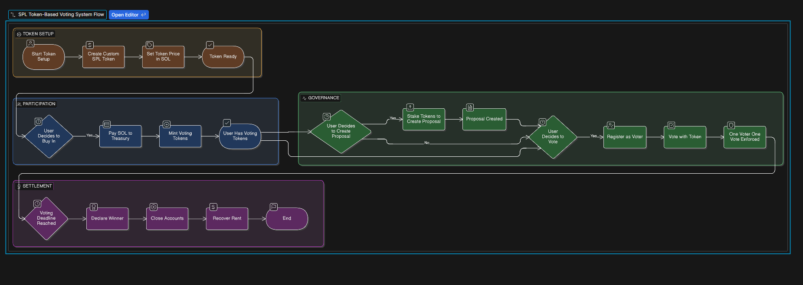

### advance vote dapp

**Treasury & Token:** The admin creates a custom SPL token (voting power) and sets a price in SOL.

**Buy In:** Users pay SOL to the treasury to mint these voting tokens.

**Proposals:** Users can stake tokens to create proposals.

**Voting:** Users use their tokens to vote. This specific contract enforces a **"One Voter, One Vote"** rule (per registration session).

**Settlement:** After a deadline passes, a winner is declared, and accounts can be closed to recover rent (storage costs).

